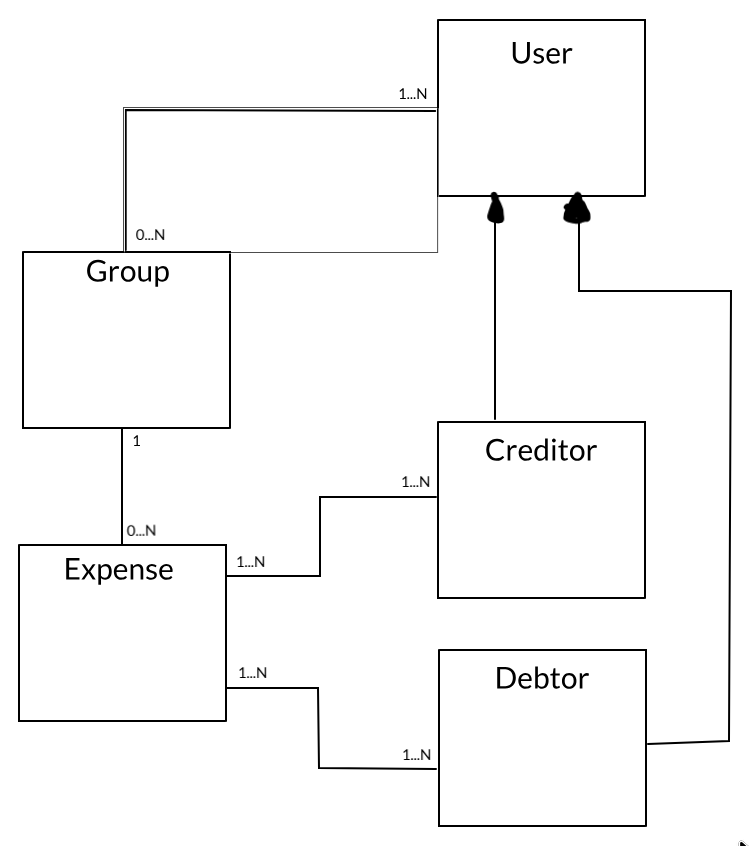

# Splitred

## Download dependencies

```
python3 -m venv venv
source venv/bin/activate
pip install --upgrade pip
pip install -r requirements.txt
```

## Run

Remember to activate your environment:
```
source venv/bin/activate
```

Run flask server with:
```
flask run
```

If packages error appear, run:

```
export PYTHONPATH=$(pwd)
```


## Classes



| Classes              | Role                                      | Observations                                |
| -------------------- | ----------------------------------------- | ------------------------------------------- |
| `User`               | Generic user of the app                   | Unique ID + username                        |
| `Group`              | Set of users that shares expenses         | Split expenses inside a group of people.    |
| `Expense`            | Concrete expense                          | Contains amount, group, debtors, creditors  |
| `Creditor`, `Debtor` | User roles inside an Expense              | Creditor implemented with tuples            |


## Use cases

| Use Case                     | Description                                                           | Actors            | Domain Objects Involved     |
|------------------------------|-----------------------------------------------------------------------|-------------------|-----------------------------|
| Create User                  | Register a new user in the system                                     | User              | User                        |
| Create Group                 | Create a new group for shared expenses                                | User              | Group, User                 |
| Add User to Group            | Add an existing user to an existing group                             | User              | Group, User                 |
| Create Expense               | Register a new shared expense with creditors and debtors              | User              | Expense, ExpenseShare, Group, User |
| Calculate User Balance       | Show how much a user owes or is owed within a group                   | User              | Expense, ExpenseShare, User |
| List Group Members           | Show all users who belong to a given group                            | User              | Group, User                 |
| List Expenses in Group       | Show all expenses recorded in a specific group                        | User              | Group, Expense              |
| Remove User from Group       | Remove a user from a group (optional: only if no active debts)        | User, Admin       | Group, User, Expense        |
| Delete Expense               | Delete an existing expense (if allowed by business rules)             | User              | Expense                     |
